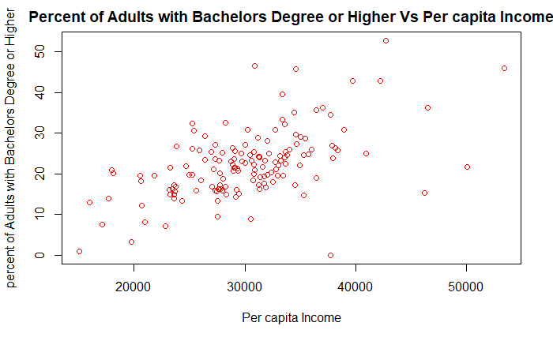

# Data_607_Final_Project
## Analysis of Education and Socioeconomic Status

## motivation for performing this analysis:
Source of motivation for the final project is the article about: 

[Education and Socioeconomic Status](https://www.apa.org/pi/ses/resources/publications/education)

## Goal of the Project:

To evaluate the impact of 
per capita income on educational attainment.

## STEPS to achieve the Goal:

## Data Sources:

Web Scraping is performed to fetch fips code for all US counties: 

[Fips Code U.S Counties](https://en.wikipedia.org/wiki/List_of_United_States_FIPS_codes_by_county)

API call to fetch Census data for all US counties:

[Census Data](https://api.census.gov/data/2019/acs/acs1?get=NAME,B01001_001E&for=county:*)

A CSV file is downloaded from 'Economic Research Service’ U.S. DEPARTMENT OF AGRICULTURE:

[CSV File](https://www.ers.usda.gov/data-products/county-level-data-sets/download-data/)

## Data Cleaning Steps:

- The three dataframes ready for cleaning are: fips_df, census_df, and education_df.
- Removing strings like 'county’.
- Convert column names to lowercase.
- Dropping the null rows.
- Renaming the columns.
- Converting CHAR to NUM.
- Split the name into two county and state columns.
- Selecting the column of interest.
- Exporting file as csv to working directory for creating a - relational database using Quick DBD tool.
- Finally, merging the three dataframes on fips code in new_df.

## Relational database Design:

## Assumptions for performing the linear regression:

- Independence of observations (aka no autocorrelation).
-  Normality.
- Linearity.
- Homoscedasticity (aka homogeneity of variance)

## Scatter plot for Assumption test:

## Homoscedasticity (aka homogeneity of variance):

## Simple Linear Regression Model & Summary:

Simple Linear Regression Equation:

percent_of_adults_with_a_bachelor_degree_or_higher_2015_19 = 
b0 + b4*per_capita_income

The F-Test of overall significance has the following two hypotheses:

Null hypothesis (H0) : The model with no predictor variables (also known as an intercept-only model) fits the data as well as the regression model defined here.

Alternative hypothesis (HA) : Your regression model fits the data better than the intercept-only model.

## Interpretation:

A large F-statistic will correspond to a statistically significant p-value (p < 0.05). In our example, the F-statistic equal 62.7 producing a p-value: 5.83e-13, which is highly significant. This means that, the predictor variables is significantly related to the outcome variable.

And we accept the alternate hypothesis that our regression model fits the data better than the intercept-only model.

## The correlation coefficient between the two variables:

r is always a number between -1 and 1. r > 0 indicates a positive association. r < 0 indicates a negative association. Values of r near 0 indicate a very weak linear relationship.

## Challenges encountered in code and/or data:

- Web scraping the SAT score was the biggest challenge.
- Merging three data frames was not easily achievable.
